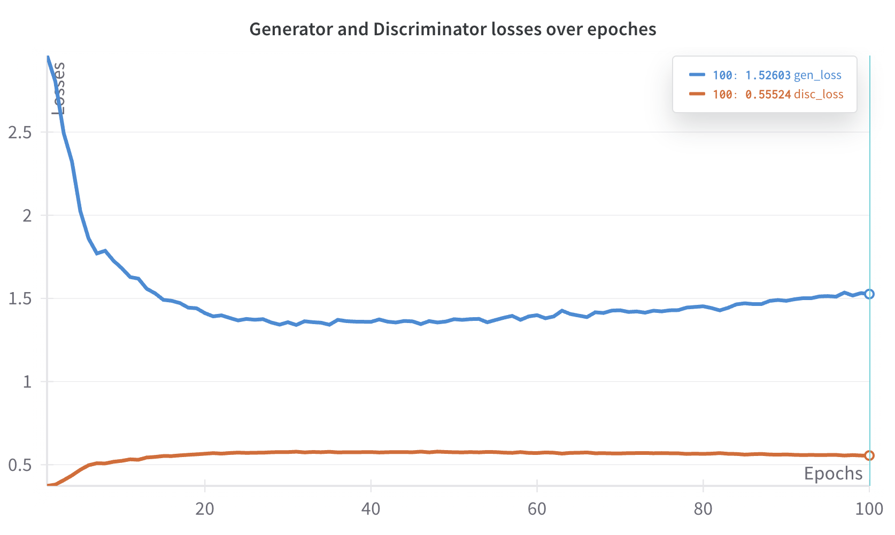
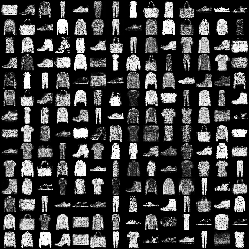
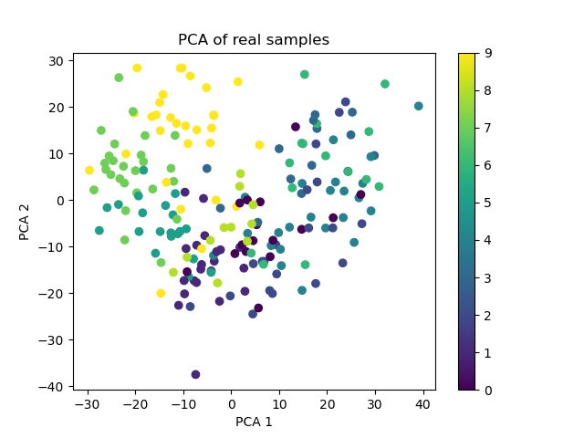
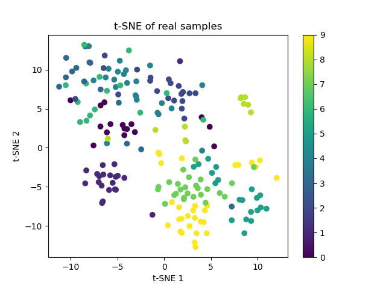
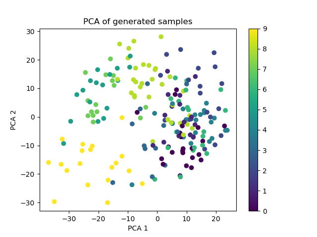
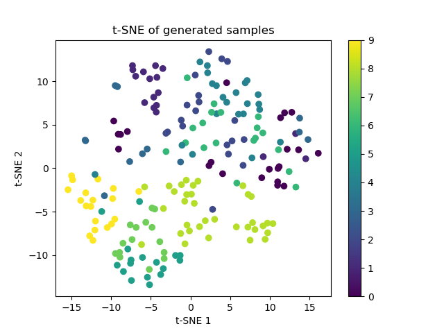

# WIP
## Task
You will work with the Fashion MNIST dataset, aiming to implement a Conditional Generative Adversarial Network (Conditional GAN) to generate images from this dataset. Start by splitting the dataset into training and test sets. While maintaining simplicity, focus on devising an innovative approach to analyze the test dataset using the Conditional GAN model. Employ data science techniques to explore and gain valuable insights from the generated data.

## Implementation
### Architecture
The architecture and implementation wholy follow the CGAN paper [1], including the choice of optimizers, schedulers, hyperparameters etc. As mentioned in the paper, the Maxout activation [2] is used for the discriminator.

During the training, the following files appear in the auto-generated folder "runs": optimal models for generator and discriminator; a checkpoint from the final epoch; samples generated during the training; a loss plot; a fid scores plot.

During the evaluation, the files created in the "eval" folder are: a batch of generated images and their labels; a batch of real data used in the evaluation; plots for dimensionality reductions (pca, tsne) for real and generated batches.

For logging, I tried to use [Weight & Biases](https://wandb.ai/site/), and indeed it does nice plots for the training.

#### Analysis
To evaluate the performance of the generated data sets, I used the FID metric and dimensionality reduction analysis. The models were trained for 100 epochs, and the checkpoints corresponding to the most optimal models were selected for evaluation.

### Results with the architecture proposed in [1] 

#### Loss
Here we can see the plot of FID score calculated for each epoch on 1000 samples. 


#### FID score
The following plot shows the loss values for both the discriminator and the generator during the training. 



#### Generation examples
The image below presents 196 generated samples. The quality is visibly far from ideal, the generated images seems noise, so there is a room for improvement.



#### Dimentionality reduction
To compare feature distributions for real and generated data, I used two algorithms: PCA and t-SNE. PCA is quite straightforward, but at first, I didn't find the clusters very meaningful, even for the real data. On the other hand, as for me, t-SNE provides better clustering, but it is stochastic (and it can even cluster random gaussian noise as mentioned in [4]). Hence, I remained them too.

To extract features from the images, I used a pretrained InceptionV3 model, as it also serves in calculating the FID score.

Real data
<div style="display: flex; justify-content: space-around;">
  
  
</div>

Generated data
<div style="display: flex; justify-content: space-around;">
  
  
</div>


### Further experiments
Trying to improve the quality of the generated images, I used some of the proposed techniques from the [3] paper.
- Normalisation of the inputs: (normalise images between -1 and 1 and use of tanh as the last layer of the generator output)
- Use of gaussian noise instead of one with uniform distribution
- One-sided label smoothing (replace the 0 and 1 targets for a classifier with smoothed values, like .9 or .1)

### Results with the some techniques improvements proposed in [3]
TODO
- generation examples
- loss plot
- PCA
- FID

## How to run
1. Install the packages and go to src folder:
    ```
    pip install -r requirements.txt
    cd src
    ```

2. Run the script (1) to train a model, (2) to run evaluation:
    ```
    ### (1) train
    python main.py --params params.yaml --train

    ### or

    python main.py --train
    ```

    ```
    ### (2) evaluate
    python main.py --params params.yaml --eval

    ### or

    python main.py --eval
    ```

The argument """--params""" is a path to the yaml file with hyperparamenets, default is params.yaml.

## Feedback
The results aren't as promising as I had hoped 😕 : quality of the generated images is currently not that high. Upon further reflection, I suppose that using convolutional layers instead of fully connected layers would have likely improved performance significantly... Anyways, it was still a nice task for me 😇

## References
[1] Mirza, M., & Osindero, S. (2014). Conditional Generative Adversarial Nets. https://arxiv.org/abs/1411.1784

[2] Goodfellow, I. J., et al. (2013). Maxout Networks. https://arxiv.org/abs/1302.4389

[3] Salimans, T., et al. (2016). Improved techniques for training GANs. https://arxiv.org/abs/1606.03498

[4] Wattenberg, et al. (2016). How to Use t-SNE Effectively. http://doi.org/10.23915/distill.00002
